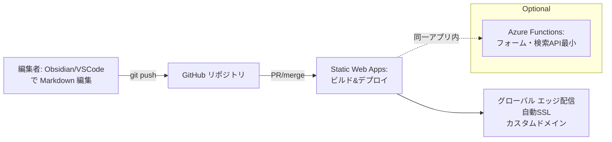

# Azure静的サイトポータル 実践ガイド

- 最小運用・低コストで**情報発信用ポータル**を継続運用するための実践ガイドです
- 前提構成：**Azure Static Web Apps（SWA） + SSG（MkDocs）** + **Github**
- 必要に応じて **Azure Functions** を同一リポジトリで併設
  - 問い合わせフォームなど最小の動的機能

更新日: 2025-09-13


## 1. 全体像（構成）



## 2. 必要なこと（要件と決定事項の表）
| 区分 | 項目 | 推奨/選択肢 | 目的/理由 | 実施タイミング |
|---|---|---|---|---|
| 基本 | SSG の選定 | **MkDocs(Material)** / Sphinx / Docusaurus / Hugo | Markdown中心で学習コスト低・日本語運用しやすい | 初期 |
| 基本 | リポジトリ | `portal-site`（mono repo） | コンテンツ/ビルド/Functionsを1つに集約 | 初期 |
| 基本 | ブランチ戦略 | `main`=本番 / `feature/*`=編集 / PRプレビュー有効 | レビュー/承認を通しやすい | 初期 |
| 基本 | デプロイ先 | **Azure Static Web Apps Standard** | PRプレビュー・カスタムドメイン・認証など | 初期 |
| 基本 | カスタムドメイン | `www.example.jp`（Apexは ALIAS/ANAME or redirect） | 到達性とブランド統一 | 初期 |
| 基本 | TLS/証明書 | SWA の自動証明書 | 証明書更新の運用をなくす | 初期 |
| 基本 | 認証(必要時) | GitHub/Microsoft 連携 or 組織メール限定 | 内部公開や編集者限定に | 初期〜拡張 |
| 表現 | 情報構造 | セクション/タグ/更新日/責任者 | 読者導線と運用の見通しを良く | 初期 |
| 表現 | トーン&スタイル | Markdown規約・画像サイズ・表記ゆれ辞書 | 品質を一定に保つ | 初期 |
| 配信 | ルーティング | `staticwebapp.config.json`でSPA/404/redirect | 期待どおりのURL挙動 | 初期 |
| 配信 | キャッシュ | 長期キャッシュ + ファイル指紋（SSG側） | 体感速度UP | 初期 |
| 検索 | サイト内検索 | **Pagefind / Lunr.js**（ビルド時生成） | サーバレスで高速検索 | 初期〜拡張 |
| 画像 | 画像最適化 | 自動リサイズ/WebP 変換ワークフロー | 軽量化と通信量削減 | 初期 |
| 動的 | 問い合わせフォーム | Functions + SendGrid（メール） | 外部サービスなしで最小構成 | 拡張 |
| 運用 | 監視 | Application Insights (JS SDK) + アラート | SLA視点の把握 | 初期 |
| 運用 | バックアップ | GitHub（コード） + Blob/Assets（必要時） | ロールバック容易性 | 継続 |
| 運用 | 品質自動化 | リンク切れ/スペル/Markdown lint CI | 品質の自動維持 | 初期〜継続 |
| 運用 | 権限 | GitHub CODEOWNERS/Branch Protection | 誰が何を承認するか明確化 | 初期 |
| セキュリティ | ヘッダー強化 | security headers を `staticwebapp.config.json` で付与 | クリックジャッキング等の軽減 | 初期 |
| セキュリティ | 脆弱性対策 | Dependabot/Actions の権限最小化 | サプライチェーン対策 | 継続 |
| 将来 | 拡張 | Azure AI Search / Front Door WAF | 大規模化・要件追加に備える | 必要時 |


## 3. 初期セットアップ手順（チェックリスト）
- [ ] 1 GitHub に `portal-site` リポジトリ作成（Private/README あり）  
- [ ] 2 SSG 雛形を追加（例：MkDocs Material）  
- [ ] 3 Azure Portal で Static Web Apps 作成（Standard / GitHub 連携）  
- [ ] 4 ビルド設定を確認（`app_location` と `output_location`）  
- [ ] 5 `staticwebapp.config.json` を追加（ルーティング/セキュリティヘッダー）  
- [ ] 6 カスタムドメインを SWA に割当（DNS CNAME 設定）  
- [ ] 7 PR プレビュー動作を確認（PR 作成→自動プレビューURL）  
- [ ] 8 監視（Application Insights）を有効化、アラート設定  
- [ ] 9 Lint/リンクチェッカー/画像最適化の CI を追加  
- [ ] 10 運用ドキュメント（更新手順・承認フロー）を `docs/` に整備  


## 4. 推奨リポジトリ構成（例：MkDocs）
```
portal-site/
├─ docs/                 # Markdown コンテンツ（日本語OK）
│  ├─ index.md
│  ├─ news/
│  └─ assets/
├─ mkdocs.yml            # ナビ/テーマ/拡張の設定
├─ staticwebapp.config.json  # ルーティング/ヘッダー
├─ api/                  # （任意）Functions のコード
│  └─ contact/index.js
├─ .github/workflows/
│  ├─ link-check.yml
│  └─ image-optimize.yml
└─ README.md
```


## 5. `staticwebapp.config.json`（最小サンプル）
```json
{
  "navigationFallback": { "rewrite": "/index.html" },
  "responseOverrides": {
    "404": { "rewrite": "/404/index.html" }
  },
  "globalHeaders": {
    "X-Content-Type-Options": "nosniff",
    "X-Frame-Options": "DENY",
    "Referrer-Policy": "strict-origin-when-cross-origin",
    "Permissions-Policy": "geolocation=(), microphone=()"
  },
  "mimeTypes": {
    ".webmanifest": "application/manifest+json"
  }
}
```


## 6. GitHub Actions（例：リンク切れチェック）
SWA のデプロイ Action は Azure 側連携で自動生成されるため、ここでは**品質担保**のワークフロー例を示します。

```yaml
name: link-check
on:
  pull_request:
    paths: ["docs/**", "mkdocs.yml"]
jobs:
  lychee:
    runs-on: ubuntu-latest
    steps:
      - uses: actions/checkout@v4
      - name: Install lychee
        run: |
          curl -sSfL https://github.com/lycheeverse/lychee/releases/latest/download/lychee-linux-x86_64             -o /usr/local/bin/lychee && chmod +x /usr/local/bin/lychee
      - name: Check links
        run: lychee docs --accept 200,206 --exclude-mail --format detailed
```


## 7. 検索の追加（Pagefind 例）
**サーバレス検索**を簡単に入れる場合の例。ビルド後に検索インデックスを生成します。

```bash
# 例: mkdocs build 後に pagefind を実行
npx pagefind --source site
```
`site/` 直下に `pagefind/` が生成されるので、テンプレートに検索 UI を組み込むだけで完了。


## 8. 問い合わせフォーム（最小 Functions 例）
> ※ メール通知は SendGrid の API Key を Azure のアプリ設定に保存（`SENDGRID_API_KEY`）。

```javascript
// api/contact/index.js (Node v18)
import fetch from "node-fetch";

export default async function (context, req) {
  const {{ name, email, message }} = req.body || {};
  if (!name || !email || !message) {{
    return {{ status: 400, jsonBody: {{ error: "Invalid payload" }} }};
  }}

  const apiKey = process.env.SENDGRID_API_KEY;
  const payload = {{
    personalizations: [{{ to: [{{ email: "info@example.jp" }}] }}],
    from: {{ email: "noreply@example.jp" }},
    subject: "お問い合わせ",
    content: [{{ type: "text/plain", value: `from: ${{name}} <${{email}}>

${{message}}` }}]
  }};

  const r = await fetch("https://api.sendgrid.com/v3/mail/send", {{
    method: "POST",
    headers: {{ "Authorization": `Bearer ${{apiKey}}`, "Content-Type": "application/json" }},
    body: JSON.stringify(payload)
  }});

  return {{ status: r.ok ? 200 : 500 }};
}
```


## 9. 運用ルール（ミニマム）
- **更新フロー**：Issue → PR（プレビュー確認）→ レビュー（CODEOWNERS）→ Merge 自動公開  
- **リリース周波数**：最低 週1 回（まとめコミット可）  
- **品質**：リンク切れ/スペル/画像サイズ/Lighthouse レポートを CI に組込み  
- **監視**：エラーレートとページ速度にアラート閾値設定  
- **権限**：Branch Protection + 必須レビュー 1 名 + Actions 権限最小化  


## 10. よくある拡張
| 分類 | 追加要素 | 効果 | いつ検討するか |
|---|---|---|---|
| セキュリティ | Front Door + WAF | 公開面の保護・地理配信 | 外部攻撃リスク/大規模化時 |
| 検索 | Azure AI Search | 大規模/高機能検索 | コンテンツ量が増えたら |
| メディア | Blob + CDN | 大容量画像/動画の高速配信 | メディア増加時 |
| QA | Playwright E2E | 表示崩れの回帰検出 | 重要ページ固定後 |
| 多言語 | i18n 設計 | 海外向けに拡張 | 将来計画時 |


## 11. 参考メモ（選定の観点）
- **SWA**は PR プレビュー・自動SSL・グローバル配信がワンストップ。最小運用に最適。  
- **MkDocs Material**は日本語案件と相性がよく、検索/ナビ/目次が整っている。  
- **Functions**は必要になった時だけ少量を追加すればよい（完全サーバレス）。


以上。必要に応じて、このファイルをベースに**プロジェクトに合わせたテンプレート（mkdocs.yml・ワークフローYAML・Functions雛形）**を具体化します。