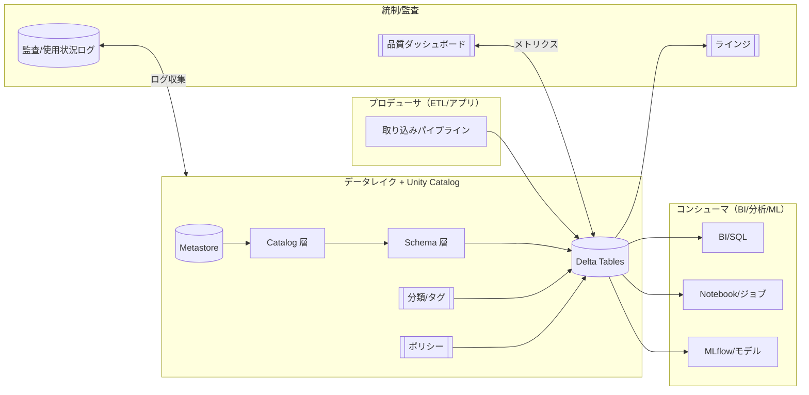
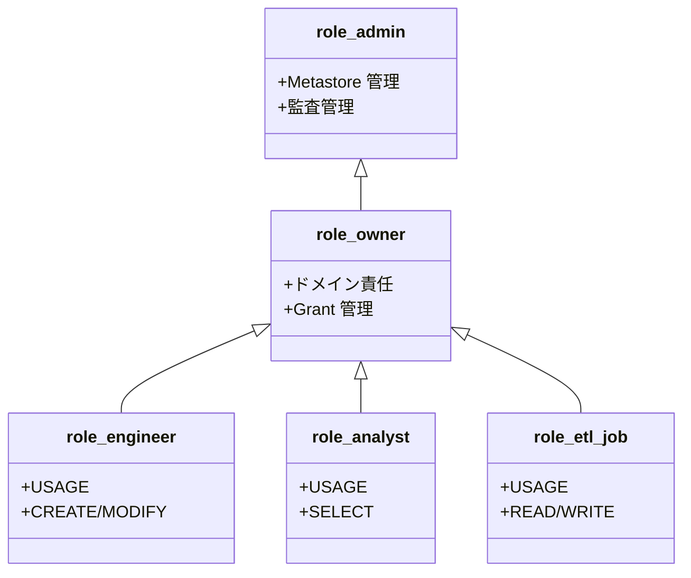
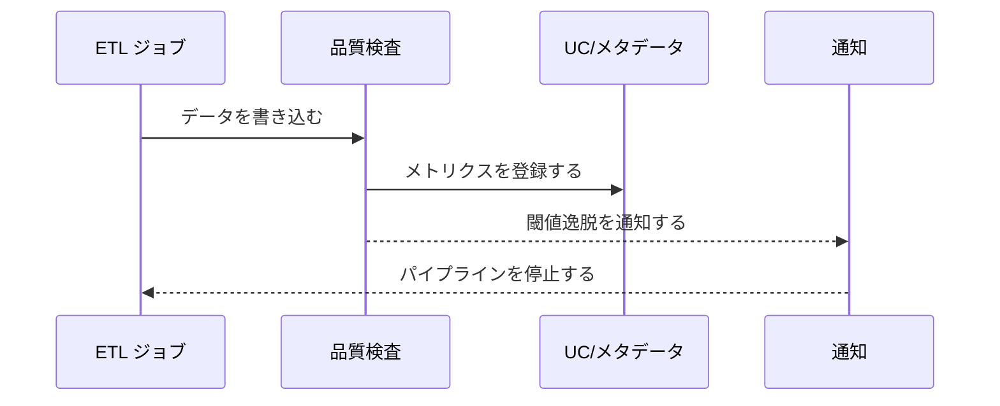
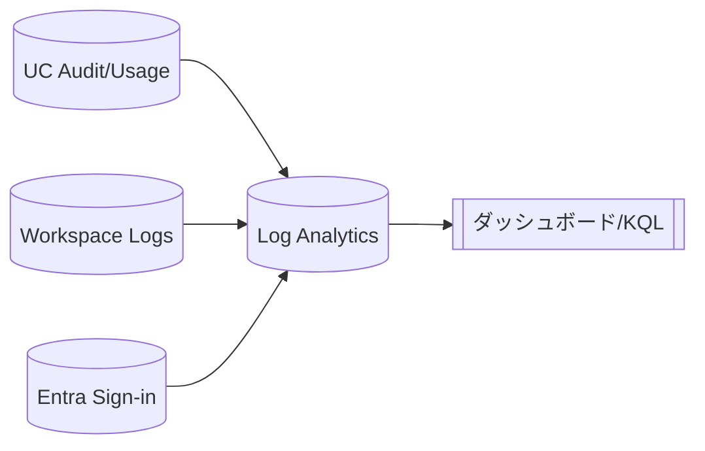
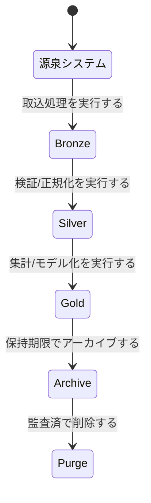
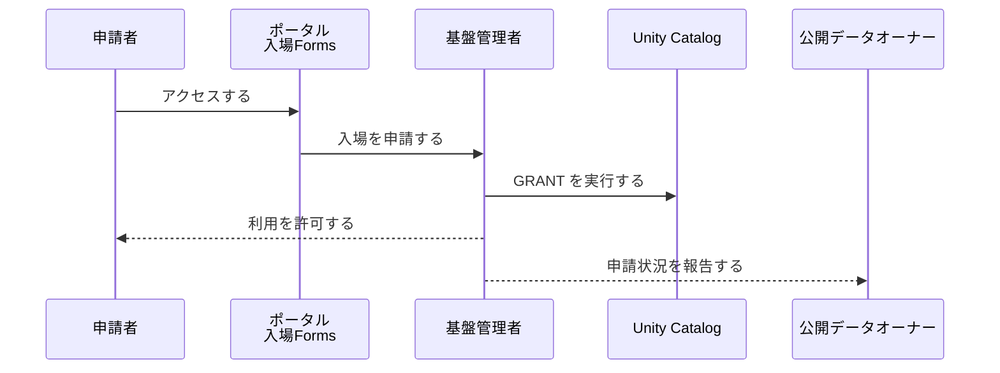
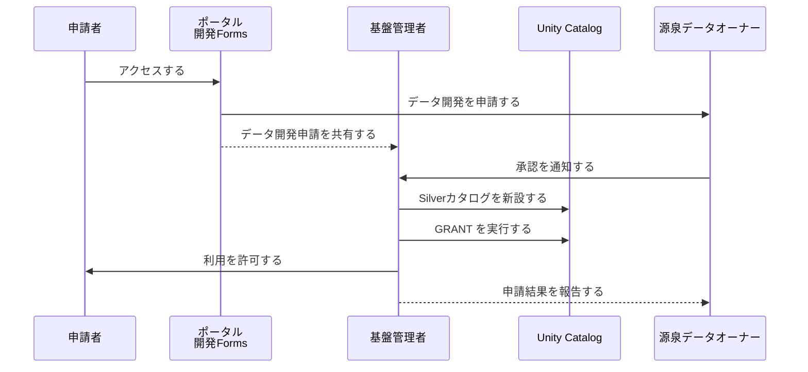

# ARCH-04_データ／カタログ＆ガバナンス（Unity Catalog）
バージョン: 0.1 / 作成日: 2025-10-15 / 作成: データ基盤チーム
対象: Azure Databricks 環境における Unity Catalog を中心としたデータガバナンス全体像の素案

## 0. 文書概要
本書はデータ資産を組織横断で安全かつ価値創出に資する形で管理するため、Unity Catalog（以下 UC）を中核としたガバナンスアーキテクチャを定義する。具体設計は DESIGN 文書、手順は BUILD 文書、運用は OPS 文書に委譲する。

## 1. ガバナンス目標
- データの可用性・完全性・機密性・追跡性をバランスよく達成する。
- 権限・分類・ラインジ・監査・品質を統合して運用する。
- プロジェクト横断で再利用可能な標準とテンプレートを確立する。

## 2. 全体アーキテクチャ


UC を中心にデータ作成から利用、統制までの責務と流れを一元化する。

## 3. 階層と命名規則
| 階層 | 役割 | 命名規則 | 例 | 原則 |
|---|---|---|---|---|
| メタストア | 全体統制を担う中枢とする | `uc-metastore-<env>` | `uc-metastore-prd` | 環境分離を徹底する。 |
| カタログ | 組織/環境境界を定める | `<org>_<env>` | `corp_prod` | 認可と監査の単位にする。 |
| スキーマ | ドメイン境界を定める | `<domain>` | `finance` | DDD に従って分割する。 |
| テーブル/ビュー | データ資産の最小単位とする | `snake_case` | `orders`, `kpi_daily` | 業務語彙で命名する。 |
| 外部ロケーション | 物理ストレージへのマップとする | `extloc_<env>_<domain>` | `extloc_prd_finance` | MI ベースで認証する。 |

## 4. データ分類とタグ
| 分類 | 取扱方針 | 技術実装 | 監査 |
|---|---|---|---|
| Public | 制限を設けない。 | `class=public` を付与する。 | 最小限の監査を維持する。 |
| Internal | 社内限定とする。 | `class=internal` を付与する。 | 標準監査を有効化する。 |
| Confidential | アクセス申請を必須とする。 | `class=confidential` を付与する。 | 権限と操作を強化監査する。 |
| Restricted | 例外承認のみ許可する。 | `class=restricted` を付与する。 | 高頻度監査を適用する。 |

タグは UC のメタデータとして付与し、カラム単位の機微属性（例：`pii=true`、`masking=strong`）も管理する。

## 5. 権限モデル


権限はグループベースで付与し、個人付与を禁止する。臨時付与は期限を設定し、棚卸で回収する。

## 6. ポリシーとデータ保護
| ポリシー | 目的 | 例 | 実装 |
|---|---|---|---|
| 行マスキング | 機微レコードを秘匿する。 | 組織/地域でフィルタする。 | ビュー/タグ駆動で実装する。 |
| 列マスキング | 機微カラムを難読化する。 | PII をハッシュ化する。 | UC 権限と UDF で実装する。 |
| 制約 | データ整合性を担保する。 | 主キー/重複禁止とする。 | Delta 制約で実装する。 |
| タイムトラベル | 誤操作から復旧する。 | 履歴参照/ロールバックとする。 | Delta の機能で実装する。 |

### ポリシー適用例（SQL）
```sql
-- 機微データへの参照をビュー越しに制限する。
CREATE OR REPLACE VIEW corp_prod.finance.txns_masked AS
SELECT
  id,
  CASE WHEN is_member('role_analyst_sensitive') THEN amount ELSE NULL END AS amount,
  ts
FROM corp_prod.finance.txns;
```

## 7. データ品質
- スキーマ変更を契約化して互換性を担保する。
- 品質メトリクス（欠損率、一意性、鮮度）を収集する。
- 品質違反時に通知/ブロックを実施する。



## 8. ラインジとメタデータ
- UC とエンジンログからテーブル間依存を解析する。
- 系譜を可視化し、影響分析を可能にする。
- 変更管理とレビューにラインジ結果を添付する。

## 9. 監査と可観測性


監査ログを Log Analytics に集約し、DDL/DML/権限変更/失敗イベントを監視する。保持期間は社内基準以上に設定する。

## 10. データライフサイクル


層ごとに権限/品質/タグを差異化し、アーカイブ/削除を自動化する。

## 11. 申請フロー

### 入場申請フロー



- 申請はForms経由で受け付ける
- チケット化し、承認履歴を保持する

### データ開発申請フロー



### データ公開申請フロー


## 12. RACI と責任
| 活動 | 企画/情報セキュリティ | データオーナー | データ基盤 | 利用部門 | 監査 |
|---|---|---|---|---|---|
| ガバナンスポリシー策定 | A | C | R | C | C |
| 権限/分類運用 | C | A | R | C | I |
| 品質/ラインジ運用 | C | C | R | A | I |
| 監査/可観測性 | C | I | R | I | A |

A=承認、R=実行、C=協議、I=通知とする。

## 13. 指標とレビュー
| 指標 | 定義 | 目標 | コメント |
|---|---|---|---|
| 権限棚卸遵守率 | 期限内に棚卸を完了する割合とする。 | 100% | 四半期実施とする。 |
| 機微データ直アクセス率 | 機微テーブルへの直接 SELECT 比率とする。 | 0% | マスクドビュー利用とする。 |
| 品質 SLA 準拠率 | 定義メトリクスの SLA 準拠率とする。 | ≥ 99% | 逸脱時に是正する。 |

## 14. 相互参照
- ARCH-03 アイデンティティ＆アクセス基盤を参照する。
- DESIGN-06 Unity Catalog 設計を参照する。
- BUILD-50 Unity Catalog 初期化を参照する。
- OPS-02 監視・アラート運用を参照する。

## 15. 変更履歴
| 版 | 日付 | 変更 | 作成/承認 |
|---|---|---|---|
| 0.1 | 2025-10-15 | 初版作成 | Data Platform Team |
