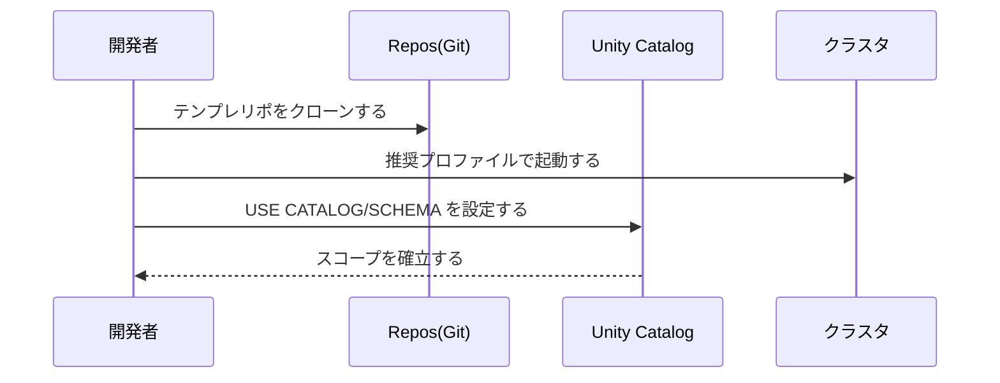
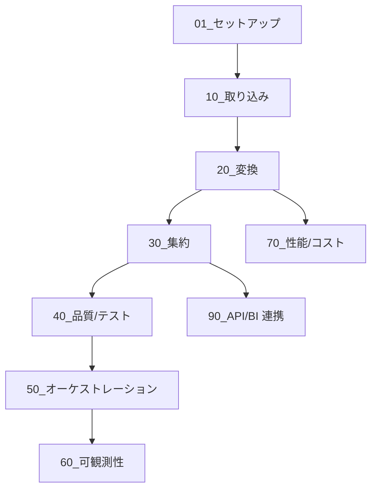
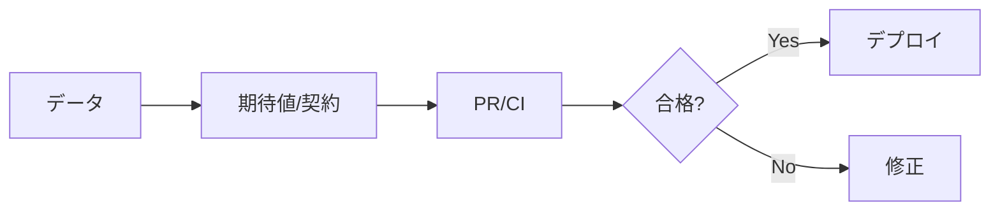
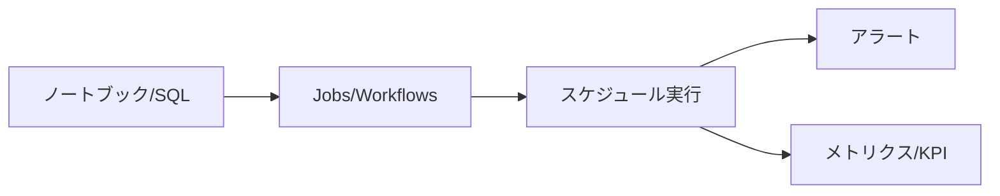

# DATA-DEV-00_総合ガイド（開発者フロー）
バージョン: 0.1 / 作成日: 2025-10-26 / 作成: データ基盤チーム  
対象: データプロダクト開発申請の承認を受けた中級者以上のデータ開発者

## 0. 文書概要
本書は Bronze→Silver→Gold の段階でデータを整備し、品質・運用・提供まで一連の開発者フローを俯瞰する。詳細は DATA-DEV シリーズ各章に委譲する。

## 1. 前提と対象
- Unity Catalog を前提に権限をロールベースで付与する。
- 閉域網 vNET と Private Link を前提に外部到達を最小化する。
- リポジトリ/ブランチ戦略とクラスタポリシーに従って作業する。

## 2. 開発者フロー全体像
```mermaid
flowchart LR
  A[データ源泉] --> B[取り込み (Bronze)]
  B --> C[変換/正規化 (Silver)]
  C --> D[集約/提供 (Gold)]
  C --> E[品質/契約/テスト]
  D --> F[提供 (SQL WH / BI / API)]
  B -.系譜.-> G[ラインジ/メタデータ]
  C -.系譜.-> G
  D -.系譜.-> G
  E --> H[監視/可観測性]
  H --> I[アラート/改善]
```
パイプラインはテンプレートに基づき構築し、各層で権限・タグ・品質を差異化する。

## 3. 役割と責任
| 役割 | 主な責務 | 主要操作 | 成果物 |
|---|---|---|---|
| データ開発者 | パイプライン実装/品質確保を担う。 | ノートブック/ジョブ/SQL を実行する。 | Bronze/Silver/Gold テーブル、DLT 定義を作成する。 |
| データオーナー | ドメインのデータ責任を負う。 | スキーマ/品質/公開可否を決定する。 | スキーマ定義、アクセス方針を承認する。 |
| データ基盤 | 環境/標準/可観測性を提供する。 | ポリシー/IaC/監視を運用する。 | テンプレ/クラスタポリシー/監視を維持する。 |

## 4. 必要要件と初期セットアップ
- データプロダクト開発申請を完了する。権限/外部ロケーションを発行する。
- Repos を接続してテンプレートをクローンする。
- 推奨クラスタプロファイル（dev-light/etl-batch）を利用する。


## 5. 層アーキテクチャと規約
| 層 | 目的 | 例 | 権限/タグ | 品質 |
|---|---|---|---|---|
| Bronze | 取り込みと原型保持を実現する。 | `raw.orders_bronze` | `class=internal`、書込=ETL | スキーマ推論/明示を徹底する。 |
| Silver | 正規化/整備/CDC を実現する。 | `silver.orders` | `class=internal`、書込=ETL | 制約/重複排除/型整備を実行する。 |
| Gold | 利用最適化/マートを実現する。 | `gold.orders_daily` | `class=confidential` 等 | マスクドビュー/SLI を定義する。 |

## 6. チュートリアル導線

- **最短ルート**：01→10→20→30→50→60  
- **品質重視**：01→10→20→40→50→60  
- **ストリーミング**：01→10→35→20→50

## 7. 最低限の実行スニペット
```sql
-- UC スコープ
USE CATALOG corp_dev;
USE SCHEMA sandbox;

-- Bronze -> Silver (例)
CREATE TABLE IF NOT EXISTS corp_dev.bronze.orders_bronze AS
SELECT * FROM VALUES (1, '2025-10-01', 100.0) AS t(order_id, order_ts, amount);
MERGE INTO corp_dev.silver.orders s
USING corp_dev.bronze.orders_bronze b
ON s.order_id=b.order_id
WHEN MATCHED THEN UPDATE SET *
WHEN NOT MATCHED THEN INSERT *;
```

```python
# Silver -> Gold 集計（PySpark）
df = spark.table("corp_dev.silver.orders")
gold = (df.groupByExpr("date_trunc('day', order_ts) as order_date")
          .agg({"amount":"sum"}).withColumnRenamed("sum(amount)","revenue"))
gold.write.mode("overwrite").saveAsTable("corp_dev.gold.orders_daily")
```

## 8. 品質とテスト

- 期待値テストで Null/重複/参照整合を検証する。
- PR で品質ゲートを通過しない限り本番反映を禁止する。

## 9. オーケストレーションと運用
- Jobs/Workflows で依存/リトライ/タイムアウトを設定する。
- 失敗通知をチャンネルに送信し、Runbook に沿って是正する。


## 10. 可観測性と指標
| 指標 | 定義 | 目標 |
|---|---|---|
| 成功率 | 期間内ジョブ成功/全実行を定義する。 | ≥ 99% |
| 遅延 | ソース到着→Gold 反映までを定義する。 | サービス基準を満たす。 |
| コスト/件 | 費用/処理件数を定義する。 | 予算内を維持する。 |

## 11. セキュリティと権限
- USAGE/SELECT/WRITE/CREATE を最小権限で付与する。
- 外部ロケーションは READ/WRITE FILES で制御する。
- 機微列はマスクドビューで提供する。

## 12. よくある落とし穴
| 症状 | 原因 | 回避 |
|---|---|---|
| Permission denied | USAGE/SELECT 不足が発生する。 | 申請ポータルからロール付与を依頼する。 |
| スコープ誤り | `USE CATALOG/SCHEMA` 未設定が発生する。 | ノートブックの先頭で設定する。 |
| 小ファイル過多 | 細切れ書込が発生する。 | Auto Loader/バッチ化と OPTIMIZE を実行する。 |

## 13. サンプルリポジトリの活用
- `data-product-template` をクローンして `notebooks/` と `pipelines/` を参照する。
- `conf/dev.yaml` にパス/カタログ/スキーマを設定する。
- `tests/` 内の期待値テストを PR に統合する。

## 14. 相互参照
- DATA-DEV-01 開発環境セットアップを参照する。
- DATA-DEV-10 取り込み（Bronze）を参照する。
- DATA-DEV-20 変換・正規化（Silver）を参照する。
- DATA-DEV-30 集約・提供（Gold）を参照する。
- DATA-DEV-40 品質・契約・テスト、DATA-DEV-50 オーケストレーションを参照する。

## 15. チェックリスト
- [ ] UC スコープを設定する。
- [ ] テンプレリポをクローンする。
- [ ] Bronze→Silver→Gold の最低限パイプラインを実行する。
- [ ] 品質テストを PR に組み込む。
- [ ] ジョブに失敗通知/リトライ/タイムアウトを設定する。

## 16. 変更履歴
| 版 | 日付 | 変更 | 作成/承認 |
|---|---|---|---|
| 0.1 | 2025-10-26 | 初版作成 | Data Platform Team |
