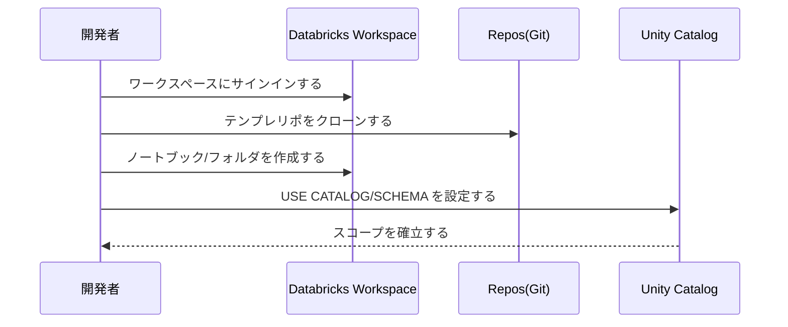
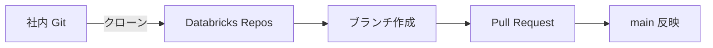
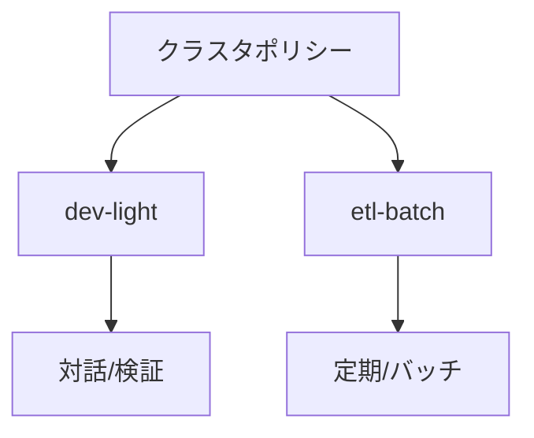
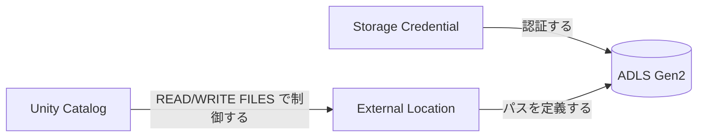

# DATA-DEV-01_開発環境セットアップ
バージョン: 0.1 / 作成日: 2025-10-26 / 作成: データ基盤チーム  
対象: データプロダクト開発申請の承認を受けた中級者以上のデータ開発者

## 0. 文書概要
本書は Databricks/Unity Catalog 前提の開発環境を最短で整備する手順を定義する。初回サインイン、Repos/Git 連携、推奨クラスタ起動、UC スコープ設定、動作確認までを通しで実施する。

## 1. 前提と権限
| 項目 | 必要内容 | 確認方法 |
|---|---|---|
| 開発申請 | データプロダクト開発申請の承認を受領する。 | 申請ポータルのステータスを確認する。 |
| アクセス | ワークスペース/Repos/UC への USAGE を付与する。 | `SHOW CATALOGS;` を実行する。 |
| 外部ロケーション | READ/WRITE FILES を必要範囲で付与する。 | 管理者からロール付与を受領する。 |
| Git | 社内 Git ホスティングにアクセスする。 | PAT/SSO の利用可否を確認する。 |

## 2. 初期セットアップ手順


## 3. Repos と Git 連携

- Repos で「Git に接続する」を選択して認証する。
- テンプレートリポジトリをクローンする。ブランチを作成する。
- 変更をコミット/プッシュして PR を作成する。レビューを経て main に反映する。

### 3.1 プロジェクト構成（推奨）
```
data-product/
  notebooks/
    10_bronze_ingest_nb.py
    20_silver_transform_nb.py
  src/
    bronze_ingest.py
    silver_transform.py
  pipelines/
    jobs/ingest_and_transform.json
  tests/
    test_quality_expectations.py
  conf/
    dev.yaml
```

## 4. クラスタ準備

- 対話/検証は **dev-light** を利用する。最小=1/最大=4、Auto Termination=20 分に設定する。
- バッチは **etl-batch** を利用する。最小=2/最大=16、Auto Termination=15 分に設定する。
- UC 対応ランタイムを選定する。ライブラリは要件ファイルで宣言する。

## 5. Unity Catalog スコープ設定と検証
- ノートブックの先頭で CATALOG/SCHEMA を設定する。
- 参照可能なカタログ/スキーマ/テーブルを確認する。

```sql
USE CATALOG corp_dev;
USE SCHEMA sandbox;
SHOW TABLES;
```

```python
# PySpark での参照
df = spark.table("corp_dev.sandbox.sample")
display(df.limit(10))
```

## 6. 外部ロケーションと資格情報

- 物理ストレージへの直接マウントを避ける。外部ロケーションを経由してファイル I/O を実行する。
- 必要に応じて READ/WRITE FILES を申請する。ジョブはサービスロールで実行する。

## 7. サンプルデータ配置
- `samples/` 配下の JSON/Parquet を ADLS に配置する。
- Bronze 用の取り込みパス（例：`abfss://raw@dlsprd.dfs.core.windows.net/orders/`）を確認する。

```python
from pyspark.sql import functions as F

# サンプル読み込み（検証用）
df = spark.read.json("abfss://raw@dlsprd.dfs.core.windows.net/orders/")
df = df.withColumn("order_ts", F.to_timestamp("order_ts"))
df.createOrReplaceTempView("v_orders_raw")
```

## 8. 動作確認（最小パイプライン）
- Bronze テーブルを作成して Silver に変換する。

```sql
CREATE TABLE IF NOT EXISTS corp_dev.bronze.orders_bronze AS
SELECT * FROM VALUES
  (1, '2025-10-01 10:00:00', 100.0),
  (2, '2025-10-01 11:00:00', 180.0)
AS t(order_id, order_ts, amount);
```

```python
from pyspark.sql import functions as F

bronze = spark.table("corp_dev.bronze.orders_bronze")
silver = (bronze.dropDuplicates(["order_id"])
          .withColumn("order_ts", F.to_timestamp("order_ts"))
          .withColumn("amount", F.col("amount").cast("decimal(18,2)")))
silver.write.mode("overwrite").option("overwriteSchema","true").saveAsTable("corp_dev.silver.orders")
```

```sql
-- 集計確認
SELECT date_trunc('day', order_ts) AS d, count(*) AS orders, sum(amount) AS revenue
FROM corp_dev.silver.orders
GROUP BY 1 ORDER BY 1;
```

## 9. ベストプラクティス
| 観点 | 推奨 | 補足 |
|---|---|---|
| スコープ | ノートブック先頭で `USE CATALOG/SCHEMA` を実行する。 | 実行ユーザーの権限で制御する。 |
| クラスタ | Auto Termination を有効化する。 | 放置コストを削減する。 |
| 依存 | ライブラリを要件ファイルで宣言する。 | 再現性/起動速度を向上する。 |
| 権限 | グループに付与して個人付与を避ける。 | 申請フローで期限を設定する。 |

## 10. トラブルシューティング
| 事象 | 例 | 原因 | 対処 |
|---|---|---|---|
| Permission denied | テーブル参照に失敗する。 | USAGE/SELECT 不足が発生する。 | ロール付与を申請する。 |
| DNS 解決失敗 | ADLS に到達しない。 | Private DNS/PE 誤設定が発生する。 | 管理者に連絡する。 |
| 依存解決失敗 | ライブラリ導入が失敗する。 | 許可外レジストリを参照する。 | 社内ミラーと要件ファイルを利用する。 |

## 11. チェックリスト
- [ ] Repos を接続してテンプレをクローンする。
- [ ] 推奨クラスタを起動して UC スコープを設定する。
- [ ] Bronze→Silver の最小パイプラインを実行する。
- [ ] PR を作成してレビューを通過する。

## 12. 相互参照
- DATA-DEV-00 総合ガイド（開発者フロー）を参照する。
- DATA-DEV-10 取り込み（Bronze）を参照する。
- USER-01 はじめに、USER-03 データアクセス（UC）を参照する。

## 13. 変更履歴
| 版 | 日付 | 変更 | 作成/承認 |
|---|---|---|---|
| 0.1 | 2025-10-26 | 初版作成 | Data Platform Team |
