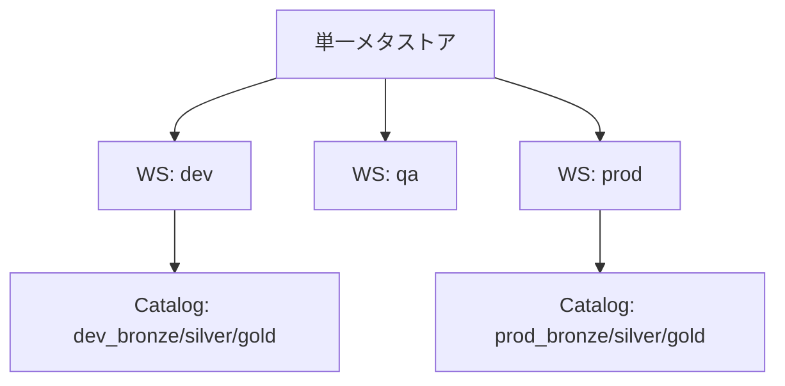
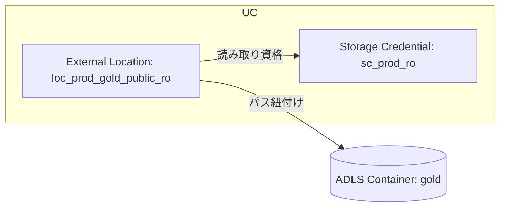
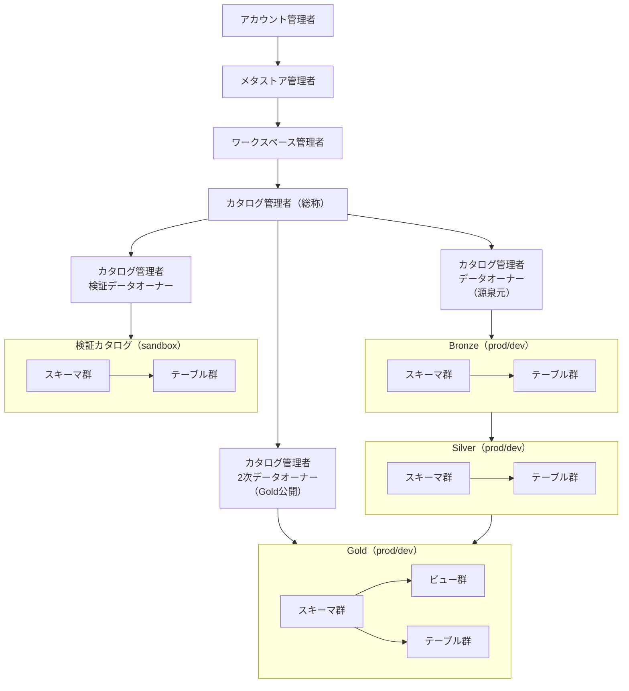

**版管理**  
- 作成日: 2025-09-20  
- 版数: v2.0
- 対象: Databricks Unity Catalog（Azure Databricks 想定）  

## 1. 目的
本書はデータ基盤におけるUnity Catalog（以下UC）の論理設計および命名規則、権限体系、外部ロケーション、カタログ設計を定義し、メダリオンアーキテクチャに基づく一貫したガバナンスを実現する。

## 2. メタストア構成
本環境はメタストアを単一で構成する。単一メタストアで全ワークスペースをガバナンス配下に置き、カタログ単位で環境分離と権限制御を行う。

### 2.1 メタストア命名規則
- 論理名: 企業共通メタストア
- 物理名: `ms_<org>-<region>-prod`
- 例: `ms_acme-jpe-prod`

### 2.2 紐付け方針
全ワークスペースを単一メタストアに紐付ける。環境差はカタログおよびワークスペース権限で表現する。



## 3. 命名規則
一貫性を担保するため論理名と物理名を定義する。物理名は英小文字・数字・アンダースコアを用いる。

### 3.1 オブジェクト命名規則（論理名/物理名）
| 対象 | 論理名 | 物理名（例） | 備考 |
|---|---|---|---|
| メタストア | 企業共通メタストア | `ms_acme-jpe-prod` | 単一構成とする |
| カタログ（dev） | 開発カタログ（層別） | `dev_bronze`, `dev_silver`, `dev_gold` | メダリオン表現とする |
| カタログ（prod） | 本番カタログ（層別） | `prod_bronze`, `prod_silver`, `prod_gold` | メダリオン表現とする |
| スキーマ | 業務領域スキーマ | `<domain>_<subdomain>` | 例: `sales_order` |
| テーブル | データセット | `<entity>_<detail>` | 例: `order_header` |
| ビュー | 公開ビュー | `v_<entity>_<purpose>` | 例: `v_order_summary` |
| 外部ロケーション | 外部ロケーション | `loc_<env>_<layer>_<area>` | 例: `loc_prod_gold_public` |
| ストレージ資格情報 | ストレージ資格情報 | `sc_<env>_<purpose>` | 例: `sc_prod_readonly` |
| ボリューム | ファイルボリューム | `vol_<env>_<domain>` | 例: `vol_dev_ml` |

## 4. 外部ロケーション設計
外部ロケーションはUCのセキュアブルとして定義し、ADLSのコンテナ/パスに対してストレージ資格情報を介してアクセスを制御する。

### 4.1 設計方針
- 層（bronze/silver/gold）× 環境（dev/prod）で外部ロケーションを分割する。  
- 書き込み系はエンジニア/ジョブに限定する。参照系はデータユーザ/アナリストに開放する。

### 4.2 外部ロケーション定義
| 論理名 | 物理名 | ADLS パス（例） | 資格情報 |
|---|---|---|---|
| 開発・Bronze ロケーション | `loc_dev_bronze_core` | `abfss://bronze@<acct>.dfs.core.windows.net/dev/core/` | `sc_dev_rw` |
| 開発・Silver ロケーション | `loc_dev_silver_core` | `abfss://silver@<acct>.dfs.core.windows.net/dev/core/` | `sc_dev_rw` |
| 開発・Gold ロケーション | `loc_dev_gold_public` | `abfss://gold@<acct>.dfs.core.windows.net/dev/public/` | `sc_dev_ro` |
| 本番・Bronze ロケーション | `loc_prod_bronze_core` | `abfss://bronze@<acct>.dfs.core.windows.net/prod/core/` | `sc_prod_rw` |
| 本番・Silver ロケーション | `loc_prod_silver_core` | `abfss://silver@<acct>.dfs.core.windows.net/prod/core/` | `sc_prod_rw` |
| 本番・Gold 読み取り専用ロケーション | `loc_prod_gold_public_ro` | `abfss://gold@<acct>.dfs.core.windows.net/prod/public/` | `sc_prod_ro` |

> 備考: `sc_*` はUCのStorage Credentialを指す。



## 5. データオブジェクト設計
スキーマを業務領域単位で定義し、テーブルとビューで公開レイヤを分離する。ジョブは書込みをスケジュール実行する。

### 5.1 スキーマ方針
- 業務領域ごとにスキーマを定義する。  
- 個人領域スキーマを禁止し、全ての資産をチーム/業務単位で管理する。

### 5.2 テーブル/ビュー方針
- Bronze/Silver はテーブル中心で構成する。  
- Gold はビュー/テーブルのハイブリッドで公開する。ビューで列マスクやフィルタを適用する。

## 6. 権限設計
Unity Catalogのセキュアブル（Catalog/Schema/Table/View/Volume/External Location）に対してロールに権限を付与する。

### 6.1 権限マトリクス（開発）
| ロール | dev_bronze | dev_silver | dev_gold |
|---|---|---|---|
| データエンジニア | `USAGE, CREATE, MODIFY, SELECT` | `USAGE, CREATE, MODIFY, SELECT` | `USAGE, SELECT` |
| データユーザ | `USAGE, SELECT` | `USAGE, SELECT` | `USAGE, SELECT` |
| データアナリスト | `USAGE, SELECT` | `USAGE, SELECT` | `USAGE, SELECT` |
| ジョブ | `USAGE, SELECT, INSERT, UPDATE, MERGE, DELETE` | `USAGE, SELECT, INSERT, UPDATE, MERGE, DELETE` | `USAGE, SELECT` |

### 6.2 権限マトリクス（本番）
| ロール | prod_bronze | prod_silver | prod_gold |
|---|---|---|---|
| データエンジニア | `USAGE, SELECT` | `USAGE, SELECT` | `USAGE, SELECT` |
| データユーザ | `USAGE, SELECT` | `USAGE, SELECT` | `USAGE, SELECT` |
| データアナリスト | `USAGE, SELECT` | `USAGE, SELECT` | `USAGE, SELECT` |
| ジョブ | `USAGE, SELECT, INSERT, UPDATE, MERGE, DELETE` | `USAGE, SELECT, INSERT, UPDATE, MERGE, DELETE` | `USAGE, SELECT` |

### 6.3 外部ロケーション権限
| ロール | Bronze/Silver 外部ロケーション | Gold 外部ロケーション |
|---|---|---|
| データエンジニア | `READ FILES, WRITE FILES` | `READ FILES` |
| データユーザ | `READ FILES` | `READ FILES` |
| データアナリスト | `READ FILES` | `READ FILES` |
| ジョブ | `READ FILES, WRITE FILES` | `READ FILES` |

> 備考: Gold本番は読み取り専用とし、書込みを禁止する。

## 7. ロール体系
ロールを階層化して最小権限を実現する。管理ロールを上位に、データ取扱ロールを下位に配置する。

### 7.1 ロール体系図



### 7.2 カタログ管理者パターン
- データオーナー（源泉元）: Bronze 主体で責任を持つ。  
- 2次データオーナー（Gold公開）: Gold 公開資産の品質と公開を担う。  
- 検証データオーナー: 検証/一時利用資産を所管する。

### 7.3 データ取扱ロール
- データエンジニア: `USAGE, CREATE/MODIFY` を中心に付与する。  
- データユーザ: `USAGE, SELECT` を付与する。  
- データアナリスト: `USAGE, SELECT` を付与する。  
- ジョブ（サービスプリンシパル）: `USAGE, READ/WRITE` を付与する。

## 8. カタログ設計
カタログでメダリオンアーキテクチャを表現し、環境別に `dev_*` と `prod_*` を分離する。

### 8.1 構成
- 開発: `dev_bronze`, `dev_silver`, `dev_gold`  
- 本番: `prod_bronze`, `prod_silver`, `prod_gold`

### 8.2 公開ポリシー
- Gold は参照中心とし、列/行レベルセキュリティで最小公開を実現する。  
- 本番Goldは読み取り専用とし、外部ロケーションでも `READ FILES` のみを許可する。

### 8.3 権限分離
- 開発はエンジニア/ジョブの書込みを許可する。  
- 本番はジョブ経由の書込みのみを許可し、人手書込みを禁止する。

## 9. 運用・監査設計
- 権限変更とオブジェクト変更を監査ログで記録する。  
- 変更要求をチケットで管理し、レビュー後に適用する。  
- サービスプリンシパルのシークレットをローテーションする。

## 10. データ保護設計
- 列マスキング/行レベルフィルタをビューで適用する。  
- PII/機微データの暗号化/トークナイズを実施する。  
- 監査対象アクセスをダッシュボードで可視化する。

## 付録A: 代表的権限一覧
| 権限 | 対象 | 説明 |
|---|---|---|
| USAGE | Catalog/Schema | オブジェクトの可視化を許可する |
| SELECT | Table/View | データの読み取りを許可する |
| CREATE | Catalog/Schema | オブジェクトの作成を許可する |
| MODIFY | Table | スキーマ変更/書換えを許可する |
| INSERT/UPDATE/MERGE/DELETE | Table | 行操作を許可する |
| READ FILES/WRITE FILES | External Location | ファイル読み書きを許可する |

## 付録B: 標準ディレクトリ構成（例）
```text
abfss://bronze@<acct>.dfs.core.windows.net/
  └─ prod/
     └─ core/
abfss://silver@<acct>.dfs.core.windows.net/
  └─ prod/
     └─ core/
abfss://gold@<acct>.dfs.core.windows.net/
  └─ prod/
     └─ public/
```