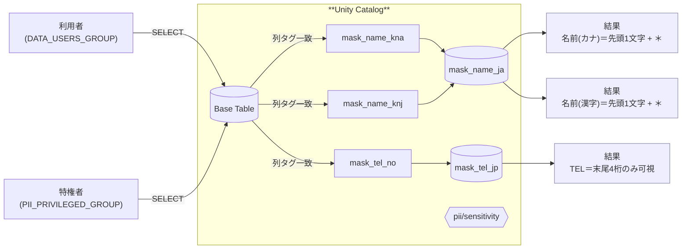

# ABACポリシー実装検討書

**版:** v1.0  
**日付:** 2025-10-13 (JST)  
**対象:** Azure Databricks + Unity Catalog（UC）

## 0. ゴール
- お客さまの**氏名（カナ/漢字）と電話番号**を「**通常利用者はマスク**／**特権グループは生値**」で閲覧させる。  
- 実装は **ABAC（属性ベースアクセス制御）** を用い、**タグ駆動**で列マスキングを適用する。  
- 運用では **「誰に適用するか」= ポリシー** と **「どう隠すか」= UDF** を分離して再利用性を高める。

> 注: ダウンロード可否（Notebook/SQL結果のDL、ノートブック/ファイルのエクスポート）は**ワークスペース全体の設定**で制御する。**タグ単位でDLだけを禁止**することはできない。必要に応じて**ワークスペース分離**や**CASB/エグレス制御**を併用する。

## 1. 前提条件
- Unity Catalog が有効で、対象カタログ/スキーマ/テーブルが UC 管理下にある。  
- ABAC（列マスキング／行フィルタ）が利用可能な環境である。  
- 組織の ID 基盤（Entra ID など）と Databricks の**アカウント/ワークスペースのグループ**が連携済み。  
- 実行エンジンは UC の要件を満たす（Serverless SQL Warehouse もしくは十分に新しい DBR を推奨）。

## 2. 設計方針（雛形）
- **対象列**: `NAME_KNA`（カナ）、`NAME_KNJ`（漢字）、`TEL_NO`（電話番号）  
- **列タグ**:  
  - `pii` = `name_kna` / `name_knj` / `tel`  
  - `sensitivity` = `high`  
- **グループ**:  
  - `<DATA_USERS_GROUP>` …… データ利用者（**マスク適用対象**）  
  - `<PII_PRIVILEGED_GROUP>` …… 特権グループ（**生値閲覧を許可**）  
- **関数（UDF）**:  
  - `mask_name_ja()` …… 先頭1文字のみ可視、以降は全角アスタリスクでマスク  
  - `mask_tel_jp()` …… 電話番号は末尾4桁のみ可視、その他の数字を全角アスタリスク化（ハイフン等は維持）  
- **ポリシー適用範囲**: スキーマ単位（推奨）。**タグに合致する列**だけに自動適用。

## 3. 実装手順

### 3.1 セキュリティ用スキーマの作成（UDF配置）
```sql
-- カタログ/スキーマ名は適宜置換してください
CREATE SCHEMA IF NOT EXISTS <CATALOG>.sec;
```

### 3.2 マスキングUDFの作成
```sql
-- 日本語氏名（カナ/漢字）: 先頭1文字だけ見せ、以降を全角アスタリスクでマスク
CREATE OR REPLACE FUNCTION <CATALOG>.sec.mask_name_ja(val STRING)
RETURNS STRING
RETURN CASE
  WHEN val IS NULL THEN NULL
  WHEN length(val) <= 1 THEN '＊'
  ELSE concat(substr(val, 1, 1), repeat('＊', greatest(length(val) - 1, 1)))
END;

-- 電話番号: 末尾4桁のみ可視、その他の数字を全角アスタリスクに（ハイフン等は維持）
CREATE OR REPLACE FUNCTION <CATALOG>.sec.mask_tel_jp(val STRING)
RETURNS STRING
RETURN CASE
  WHEN val IS NULL THEN NULL
  ELSE regexp_replace(val, '(\\d)(?=(?:\\D*\\d){4})', '＊')
END;
```

### 3.3 列タグの付与
```sql
-- 例: 顧客テーブルに列タグを設定（既存テーブルに対して実行）
-- テーブル: <CATALOG>.<SCHEMA>.<TABLE>
SET TAG COLUMN <CATALOG>.<SCHEMA>.<TABLE>.NAME_KNA 'pii'='name_kna', 'sensitivity'='high';
SET TAG COLUMN <CATALOG>.<SCHEMA>.<TABLE>.NAME_KNJ 'pii'='name_knj', 'sensitivity'='high';
SET TAG COLUMN <CATALOG>.<SCHEMA>.<TABLE>.TEL_NO   'pii'='tel',      'sensitivity'='high';
```

### 3.4 ABACポリシーの作成（列ごと）
```sql
-- (a) カナ氏名 NAME_KNA
CREATE POLICY mask_name_kna
ON SCHEMA <CATALOG>.<SCHEMA>
COMMENT 'Mask NAME_KNA for non-privileged users'
COLUMN MASK <CATALOG>.sec.mask_name_ja
TO <DATA_USERS_GROUP>
EXCEPT <PII_PRIVILEGED_GROUP>
FOR TABLES
  WHEN hasTagValue('sensitivity','high')
  MATCH COLUMNS hasTagValue('pii','name_kna') AS name_kna
ON COLUMN name_kna;

-- (b) 漢字氏名 NAME_KNJ
CREATE POLICY mask_name_knj
ON SCHEMA <CATALOG>.<SCHEMA>
COMMENT 'Mask NAME_KNJ for non-privileged users'
COLUMN MASK <CATALOG>.sec.mask_name_ja
TO <DATA_USERS_GROUP>
EXCEPT <PII_PRIVILEGED_GROUP>
FOR TABLES
  WHEN hasTagValue('sensitivity','high')
  MATCH COLUMNS hasTagValue('pii','name_knj') AS name_knj
ON COLUMN name_knj;

-- (c) 電話番号 TEL_NO
CREATE POLICY mask_tel_no
ON SCHEMA <CATALOG>.<SCHEMA>
COMMENT 'Mask TEL_NO for non-privileged users'
COLUMN MASK <CATALOG>.sec.mask_tel_jp
TO <DATA_USERS_GROUP>
EXCEPT <PII_PRIVILEGED_GROUP>
FOR TABLES
  WHEN hasTagValue('sensitivity','high')
  MATCH COLUMNS hasTagValue('pii','tel') AS tel_no
ON COLUMN tel_no;
```

- 補足: **各列に同時に有効なマスクは1つ**です。
  - 既に手動マスク（`ALTER TABLE ... SET MASK` 等）がある場合は整理してください。

## 4. 動作確認・検証手順
### 4.1 検証用データ（任意）
```sql
CREATE TABLE IF NOT EXISTS <CATALOG>.<SCHEMA>.<TABLE> (
  CUST_ID   STRING,
  NAME_KNA  STRING,
  NAME_KNJ  STRING,
  TEL_NO    STRING
);

INSERT INTO <CATALOG>.<SCHEMA>.<TABLE> VALUES
('C001','ﾔﾏﾀﾞﾀﾛｳ','山田太郎','090-1234-5678'),
('C002','ｽｽﾞｷﾊﾅｺ','鈴木花子','03-1111-2222');
```

```sql
-- 付与忘れチェック: 列タグが載っているか確認
SHOW TAGS COLUMNS IN <CATALOG>.<SCHEMA>.<TABLE>;
```

### 4.2 結果確認
- **データ利用者（<DATA_USERS_GROUP> に所属）でクエリ**:  
  - `NAME_KNA`/`NAME_KNJ` は先頭1文字＋`＊`にマスク、`TEL_NO` は末尾4桁以外が `＊`。  
- **特権側（<PII_PRIVILEGED_GROUP> に所属）でクエリ**:  
  - 3列すべて生値が見える。

> うまく効かない場合は、(1) 列タグの指定ミス、(2) ポリシーの適用範囲（スキーマ誤り）、(3) 実行ユーザーの所属グループ、(4) 対象エンジンの要件未満、の順で点検する。


## 5. 運用と監査
- **変更管理**: ポリシー/タグ/UDF は IaC（Terraform/Databricks Asset Bundle 等）でコード管理し、PR レビューを必須化する。  
- **監査**: クエリ監査ログ（SQL 監査）、権限変更ログ、ポリシー変更履歴を保全。  
- **命名規約**: `mask_<領域>_<列/カテゴリ>` で統一し、コメントに対象/例外/意図を明記する。


## 6. 既知の制約と落とし穴
- **ビューに列マスクは付与不可**（制御は**基表**に付与する）。ビューで制御したい場合は**ビュー内SQLでマスク/条件分岐**を書く。  
- **1列=1マスク**。重複適用は不可。  
- **タグの伝播**: `MATCH COLUMNS hasTagValue(...)` はタグが**列に存在**することが前提。表やスキーマだけに付けて終わらないよう注意。  
- **ダウンロード統制は別レイヤ**: ABACは結果セットの**見せ方**を制御する。ダウンロード/エクスポート可否は**ワークスペース設定**または**CASB**などで制御する。


## 7. ABAC と動的ビューの補足（使い分け）
- **ABAC**: 同一の“基表名のまま”列マスク/行フィルタを中央ポリシーで一括適用→**大規模運用に強い**。  
- **動的ビュー**: JOIN/集計/カラム整形を含めた**見せ方**をビューに閉じ込めて配布→**用途別の窓口**を作りやすい。  
- 推奨は **ABAC（基盤）＋動的ビュー（用途別）** の併用。


## 8. ロールバック手順
```sql
-- ポリシー削除
DROP POLICY IF EXISTS mask_name_kna ON SCHEMA <CATALOG>.<SCHEMA>;
DROP POLICY IF EXISTS mask_name_knj ON SCHEMA <CATALOG>.<SCHEMA>;
DROP POLICY IF EXISTS mask_tel_no   ON SCHEMA <CATALOG>.<SCHEMA>;

-- 列タグ解除（必要なもののみ）
ALTER TABLE <CATALOG>.<SCHEMA>.<TABLE>
  ALTER COLUMN NAME_KNA UNSET TAGS('pii','sensitivity');
ALTER TABLE <CATALOG>.<SCHEMA>.<TABLE>
  ALTER COLUMN NAME_KNJ UNSET TAGS('pii','sensitivity');
ALTER TABLE <CATALOG>.<SCHEMA>.<TABLE>
  ALTER COLUMN TEL_NO   UNSET TAGS('pii','sensitivity');

-- UDF削除（共有利用がない場合）
DROP FUNCTION IF EXISTS <CATALOG>.sec.mask_name_ja;
DROP FUNCTION IF EXISTS <CATALOG>.sec.mask_tel_jp;
```


## 9. 参考：一括実行テンプレート（置換してそのまま流用可）
> 置換: `<CATALOG>` `<SCHEMA>` `<TABLE>` `<DATA_USERS_GROUP>` `<PII_PRIVILEGED_GROUP>`
```sql
-- 1) UDF配置
CREATE SCHEMA IF NOT EXISTS <CATALOG>.sec;

CREATE OR REPLACE FUNCTION <CATALOG>.sec.mask_name_ja(val STRING)
RETURNS STRING
RETURN CASE
  WHEN val IS NULL THEN NULL
  WHEN length(val) <= 1 THEN '＊'
  ELSE concat(substr(val, 1, 1), repeat('＊', greatest(length(val) - 1, 1)))
END;

CREATE OR REPLACE FUNCTION <CATALOG>.sec.mask_tel_jp(val STRING)
RETURNS STRING
RETURN CASE
  WHEN val IS NULL THEN NULL
  ELSE regexp_replace(val, '(\\d)(?=(?:\\D*\\d){4})', '＊')
END;

-- 2) 列タグ付与
SET TAG COLUMN <CATALOG>.<SCHEMA>.<TABLE>.NAME_KNA 'pii'='name_kna', 'sensitivity'='high';
SET TAG COLUMN <CATALOG>.<SCHEMA>.<TABLE>.NAME_KNJ 'pii'='name_knj', 'sensitivity'='high';
SET TAG COLUMN <CATALOG>.<SCHEMA>.<TABLE>.TEL_NO   'pii'='tel',      'sensitivity'='high';

-- 3) ポリシー
CREATE POLICY mask_name_kna
ON SCHEMA <CATALOG>.<SCHEMA>
COMMENT 'Mask NAME_KNA for non-privileged users'
COLUMN MASK <CATALOG>.sec.mask_name_ja
TO <DATA_USERS_GROUP>
EXCEPT <PII_PRIVILEGED_GROUP>
FOR TABLES
  WHEN hasTagValue('sensitivity','high')
  MATCH COLUMNS hasTagValue('pii','name_kna') AS name_kna
ON COLUMN name_kna;

CREATE POLICY mask_name_knj
ON SCHEMA <CATALOG>.<SCHEMA>
COMMENT 'Mask NAME_KNJ for non-privileged users'
COLUMN MASK <CATALOG>.sec.mask_name_ja
TO <DATA_USERS_GROUP>
EXCEPT <PII_PRIVILEGED_GROUP>
FOR TABLES
  WHEN hasTagValue('sensitivity','high')
  MATCH COLUMNS hasTagValue('pii','name_knj') AS name_knj
ON COLUMN name_knj;

CREATE POLICY mask_tel_no
ON SCHEMA <CATALOG>.<SCHEMA>
COMMENT 'Mask TEL_NO for non-privileged users'
COLUMN MASK <CATALOG>.sec.mask_tel_jp
TO <DATA_USERS_GROUP>
EXCEPT <PII_PRIVILEGED_GROUP>
FOR TABLES
  WHEN hasTagValue('sensitivity','high')
  MATCH COLUMNS hasTagValue('pii','tel') AS tel_no
ON COLUMN tel_no;
```


## 10. 図解（Mermaid）


