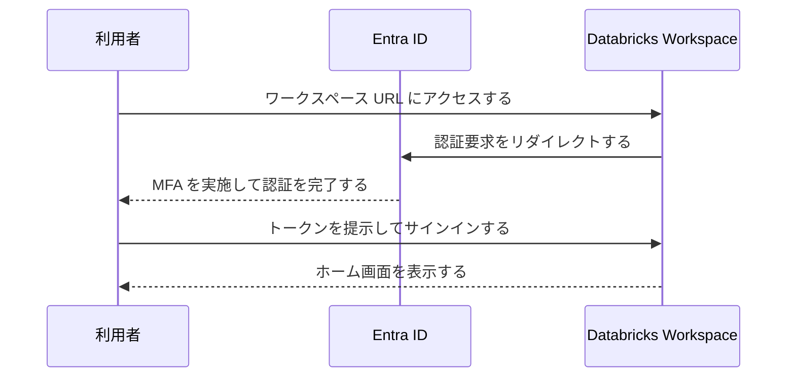
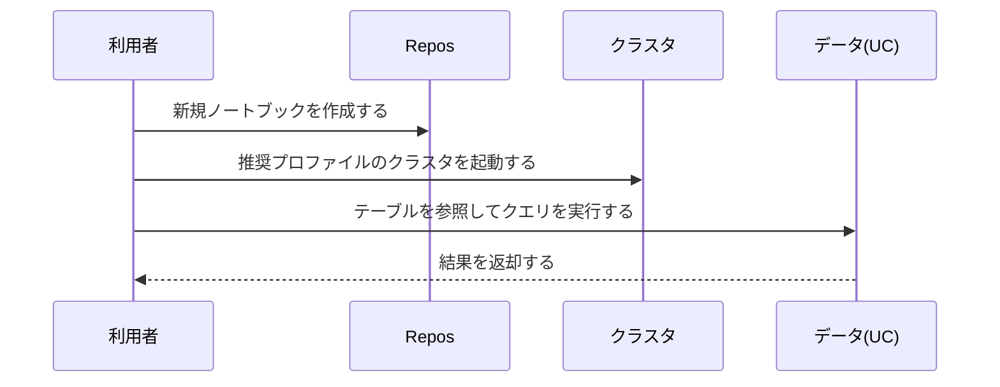
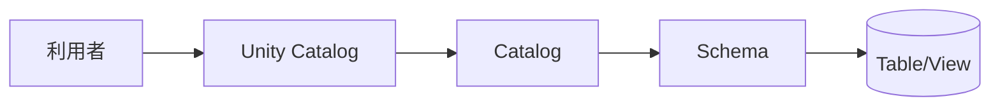
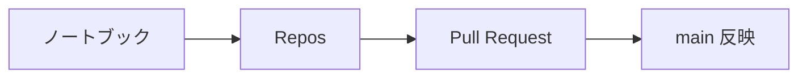
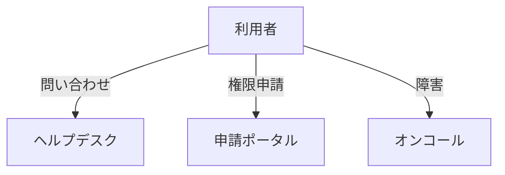

# USER-01_はじめに（初回サインイン＆ワークスペース概要）
バージョン: 0.1 / 作成日: 2025-10-26 / 作成: データ基盤チーム
対象: Azure Databricks を初めて利用するユーザー向けのスターターガイド

## 0. 文書概要
本書は初回サインインからワークスペースの基本操作までを段階的に説明する。環境は閉域網 vNET と Unity Catalog を前提に構成する。組織標準のガバナンスとセキュリティに従って作業する。

## 1. 初回サインイン手順

- 受領したワークスペース URL にアクセスする。ブックマークに保存する。
- Entra ID の MFA を実施してサインインする。
- 初回起動のガイドを確認して閉じる。
- 既定カタログ/スキーマを付与されていることを確認する。

### 1.1 トラブル時の確認
| 症状 | 例 | 確認/対処 |
|---|---|---|
| サインイン不可 | MFA 失敗が発生する。 | 端末姿勢とネットワークを確認する。管理者に連絡する。 |
| 許可不足 | ノートブック作成ができない。 | 役割付与を申請する。所属プロジェクトを確認する。 |

## 2. ワークスペース画面構成
```mermaid
flowchart LR
  H[ホーム] --> WS[ワークスペース/Repos]
  H --> UC[データ(UC)]
  H --> JOBS[ワークフロー]
  H --> WH[SQL ウェアハウス]
  H --> CLU[コンピュート]
  H --> ML[モデル/実験]
  H --> SET[設定/アカウント]
```
- 左ナビゲーションから主要機能に移動する。
- Repos で Git と連携してノートブックを管理する。
- データでは Unity Catalog のカタログ/スキーマ/テーブルを参照する。
- コンピュートではクラスタ/ジョブクラスタ/ウェアハウスを確認する。

## 3. ノートブック作成と実行

- 「新規」からノートブックを作成する。言語を指定する。
- 推奨クラスタプロファイルを選択して起動する。
- `USE CATALOG <catalog>; USE SCHEMA <schema>;` を実行してスコープを設定する。
- 実行結果を確認し、必要に応じてグラフ表示を選択する。

### 3.1 サンプルコード
```sql
USE CATALOG corp_dev;
USE SCHEMA sandbox;
SELECT current_user(), current_timestamp();
```

```python
# pandas を用いた集計を実行する
df = spark.table("corp_dev.sandbox.sample")
display(df.groupBy("category").count().orderBy("count", ascending=False))
```

## 4. データアクセスの基本

- 権限は UC の USAGE/SELECT を通じて付与される。
- テーブルはカタログ.スキーマ.オブジェクト名で参照する。
- 機微データはマスクドビュー経由で参照する。

### 4.1 よく使うコマンド
| 用途 | 例 | 説明 |
|---|---|---|
| カタログ一覧 | `SHOW CATALOGS;` | 参照可能カタログを確認する。 |
| スキーマ切替 | `USE SCHEMA corp_dev.sandbox;` | 実行スコープを設定する。 |
| 権限確認 | `SHOW GRANTS ON TABLE corp_dev.sandbox.t;` | 自身の権限を確認する。 |

## 5. クラスタの基本
- 対話用途はオールパーパスを利用する。
- バッチはジョブクラスタを利用する。
- Auto Termination を有効化して放置コストを削減する。

### 5.1 推奨プロファイル
| 名称 | 用途 | DBR | 最小/最大 | Termination |
|---|---|---|---|---|
| dev-light | 開発/検証 | LTS | 1/4 | 20 分 |
| etl-batch | バッチ | LTS | 2/16 | 15 分 |

## 6. Git/Repos の基本

- Repos に接続してブランチを作成する。
- 変更をコミットして Pull Request を作成する。
- レビューを経て main に反映する。

## 7. セキュリティとコンプライアンス
- シークレットは Key Vault 連携スコープで参照する。
- 個人トークン（PAT）の恒常利用を禁止する。
- 実行ログと監査ログを常に確認する。

## 8. ヘルプとサポート

- 仕様や操作はヘルプデスクに問い合わせる。
- 権限は申請ポータルで申請する。
- 障害はオンコールに連絡する。

## 9. よくあるエラー
| 事象 | 例 | 対処 |
|---|---|---|
| Permission denied | テーブル参照が失敗する。 | UC の権限を申請する。 |
| DNS 解決失敗 | ストレージに到達しない。 | Private DNS と PE を確認する。 |
| パッケージ導入失敗 | 外部リポジトリから取得できない。 | 社内ミラーを利用する。 |

## 10. チェックリスト
- [ ] 初回サインインを完了する。
- [ ] 既定カタログ/スキーマを確認する。
- [ ] 推奨プロファイルでクラスタを起動する。
- [ ] Repos に接続してノートブックを保存する。
- [ ] 監査ログとアラートを確認する。

## 11. 用語集
| 用語 | 説明 |
|---|---|
| UC | Unity Catalog を指す。 |
| DBR | Databricks Runtime を指す。 |
| WH | SQL ウェアハウスを指す。 |

## 12. 相互参照
- USER-02 クラスタ利用とベストプラクティスを参照する。
- ARCH-03 アイデンティティ＆アクセス基盤を参照する。
- DESIGN-06 Unity Catalog 設計を参照する。

## 13. 変更履歴
| 版 | 日付 | 変更 | 作成/承認 |
|---|---|---|---|
| 0.1 | 2025-10-26 | 初版作成 | Data Platform Team |
