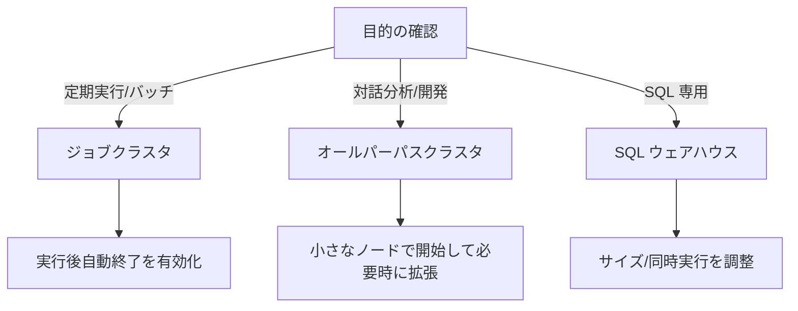
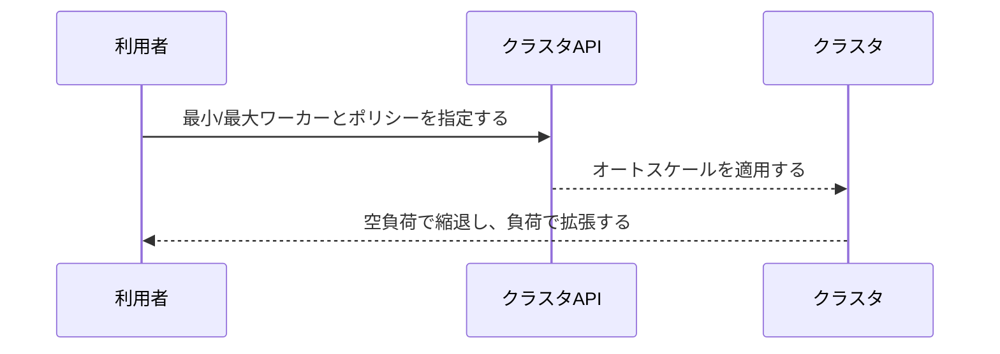
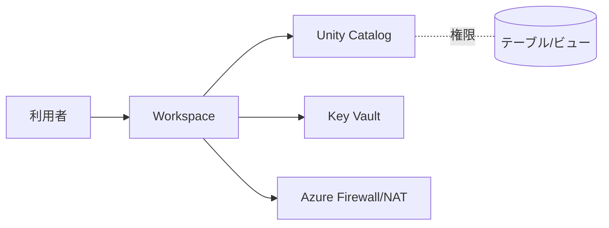

# USER-02_クラスタ利用とベストプラクティス
バージョン: 0.1 / 作成日: 2025-10-26 / 作成: データ基盤チーム
対象: Azure Databricks 利用者（データエンジニア/アナリスト/ML エンジニア）向けのクラスタ利用指針

## 0. 文書概要
本書は閉域網 vNET 前提の Databricks 環境で、クラスタを安全かつ高効率に利用するための実践指針を定義する。各種クラスタ種別、ランタイム、スケーリング、ライブラリ、セキュリティ、コスト、運用の観点を整理する。

## 1. 前提と対象
- Unity Catalog を既定とし、権限はグループベースで付与する。
- No Public IP と Private Link を前提とし、外部到達は最小 Egress のみ許可する。
- クラスタポリシーで推奨設定を強制し、逸脱を禁止する。

## 2. クラスタ種別と選定基準

- 定期処理は **ジョブクラスタ**を選定する。毎回クリーンに起動して環境差異を低減する。
- 対話用途は **オールパーパス**を選定する。Auto Termination を短めに設定する。
- SQL は **SQL ウェアハウス**を選定する。コストはクラス別に管理する。

## 3. ランタイム方針
- 既定ランタイムは安定版の Databricks Runtime（DBR）を利用する。
- UC 利用時は **DBR+UC 対応版**を選定する。
- 互換性検証を Stg で実施し、段階的に Prod へ昇格する。
- GPU/ML は ML ランタイムを選定する。ドライバとライブラリの整合を確認する。

## 4. ノード選定とスケーリング

- ノード種はワークロード特徴（CPU/GPU/メモリ/IO）で選定する。
- **オートスケール**を既定とし、最小=小さく/最大=需要に合わせて設定する。
- **Auto Termination** を 15〜60 分で設定する。深夜バッチは終了を徹底する。
- Azure Spot を検討する。再実行可能性と SLA を考慮して採用する。

## 5. コスト最適化
| 施策 | 内容 | 効果 | 留意点 |
|---|---|---|---|
| ジョブクラスタ化 | ジョブごとに起動/終了する。 | リーク防止/コスト低減を達成する。 | 起動時間を考慮する。 |
| Auto Termination | 無負荷で終了する。 | 放置コストを抑制する。 | 共有クラスタで短めに設定する。 |
| クラスタポリシー | 上限/ノード種/Spot を制約する。 | 予算遵守を担保する。 | 例外申請を運用する。 |
| ライブラリ集約 | 事前ビルド wheel/conda を配布する。 | 再現性/起動高速化を実現する。 | セキュリティ審査を実施する。 |
| SQL ウェアハウス調整 | コンカレンシ/サイズを調整する。 | 待ち時間/コストを最適化する。 | 最大同時実行を監視する。 |

## 6. ライブラリ管理
- 依存は要件ファイル（requirements.txt / conda.yaml / pom.xml）で宣言する。
- 検証済みの社内リポジトリ/ミラーを利用する。任意インターネットの取得を禁止する。
- ライブラリはクラスタポリシーで許可リストを運用する。ドライバノードの負担を考慮してインストールする。

## 7. セキュリティ設定

- データアクセスは Unity Catalog 権限で制御する。OS レベルのマウントを避ける。
- シークレットは Key Vault 連携スコープで管理する。平文埋め込みを禁止する。
- 監査ログ/使用状況ログを有効化する。重要操作を常時監視する。

## 8. Unity Catalog と権限
- USAGE/SELECT/WRITE/CREATE を最小権限で付与する。
- 役割は Entra ID グループで運用する。個人付与を禁止する。
- 外部ロケーションは READ/WRITE FILES を用途別に付与する。

## 9. ワークフロー運用
```mermaid
flowchart LR
  NB[Notebook/SQL] --> GIT[Repos(Git)]
  GIT --> JOBS[ジョブ/ワークフロー]
  JOBS --> RUN[スケジュール実行]
  RUN --> ALRT[アラート/失敗通知]
  RUN --> METRICS[実行メトリクス]
```
- コードは Repos に格納する。レビュー/CI を通過させる。
- ジョブはリトライ/タイムアウト/依存関係を設定する。
- 失敗通知をチャネルに送信する。重要ジョブはオンコールにエスカレートする。

## 10. トラブルシューティング
| 事象 | 例 | 対処 |
|---|---|---|
| クラスタ起動失敗 | イメージ/ライブラリエラーが発生する。 | ランタイム互換を確認し、許可リストを更新する。 |
| 名前解決失敗 | ADLS/KV の FQDN が解決しない。 | Private DNS/PE を確認する。 |
| 権限不足 | テーブル/ロケーションにアクセスできない。 | UC Grants を申請する。 |
| コスト急増 | ノードがスケールし続ける。 | 最小/最大ワーカーと Auto Termination を見直す。 |

## 11. 推奨設定プロファイル
| プロファイル | 用途 | DBR | 最小/最大 | Termination | Spot | ライブラリ |
|---|---|---|---|---|---|---|
| dev-light | 開発/対話 | LTS | 1/4 | 20 分 | 無効 | 既定のみとする。 |
| etl-batch | バッチ | LTS | 2/16 | 15 分 | 有効 | 要件ファイルを適用する。 |
| sql-small | BI/SQL | SQL WH Small | 同時 4 | 自動 | - | なしとする。 |

## 12. チェックリスト
- [ ] ジョブはジョブクラスタで実行する。
- [ ] Auto Termination を有効化する。
- [ ] ランタイムを安定版に固定する。
- [ ] ライブラリを宣言管理する。
- [ ] UC 権限を最小で付与する。
- [ ] 監査ログとアラートを確認する。

## 13. よくある質問
- Q: 自分のノートブックで大規模メモリが必要なときはどうするか。  
  A: 一時的に大きなノードのプロファイルを申請して利用する。終了後に既定へ戻す。
- Q: 外部の Python パッケージを追加したいときはどうするか。  
  A: 申請フローで審査を通過した上で社内ミラーへ登録する。

## 14. 相互参照
- ARCH-02 ネットワーク＆セキュリティを参照する。
- DESIGN-06 Unity Catalog 設計を参照する。
- OPS-05 ランタイム＆ポリシー運用を参照する。

## 15. 変更履歴
| 版 | 日付 | 変更 | 作成/承認 |
|---|---|---|---|
| 0.1 | 2025-10-26 | 初版作成 | Data Platform Team |
