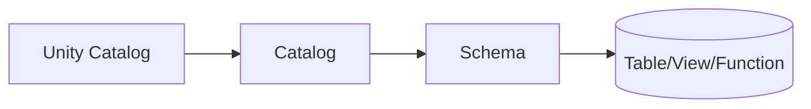
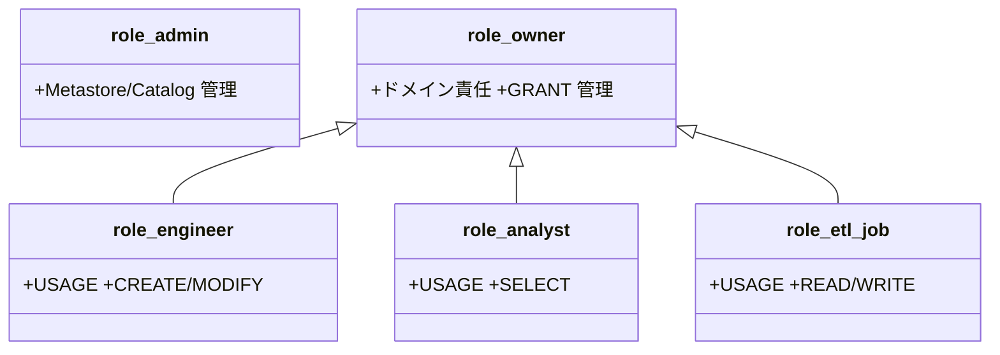
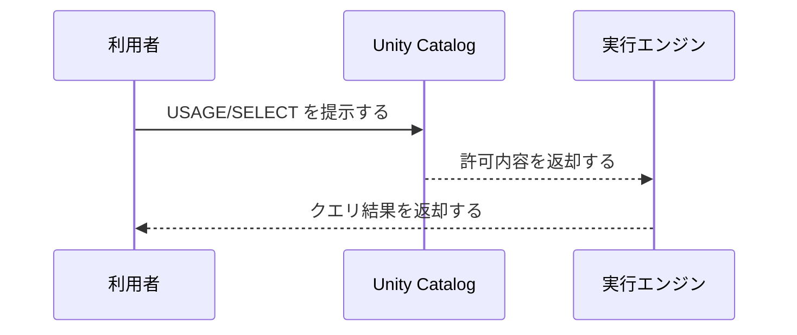
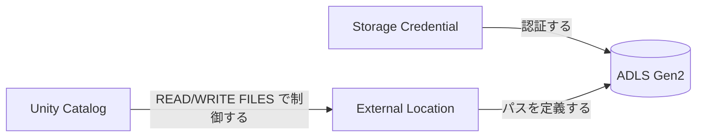
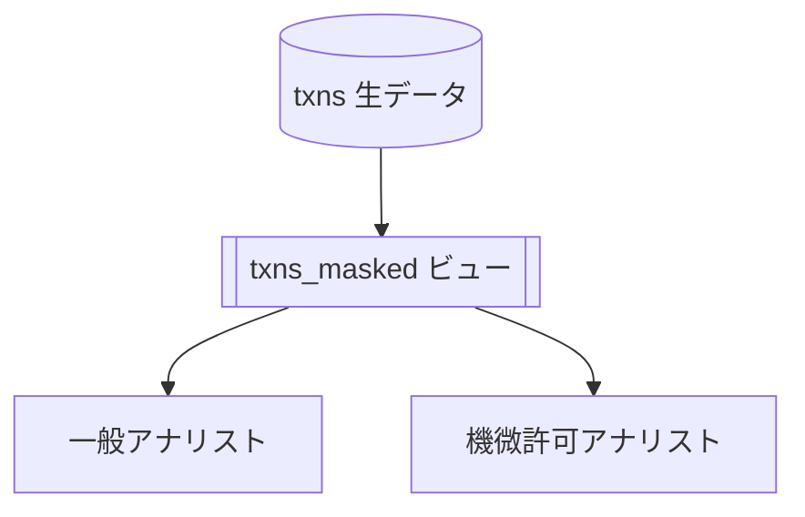
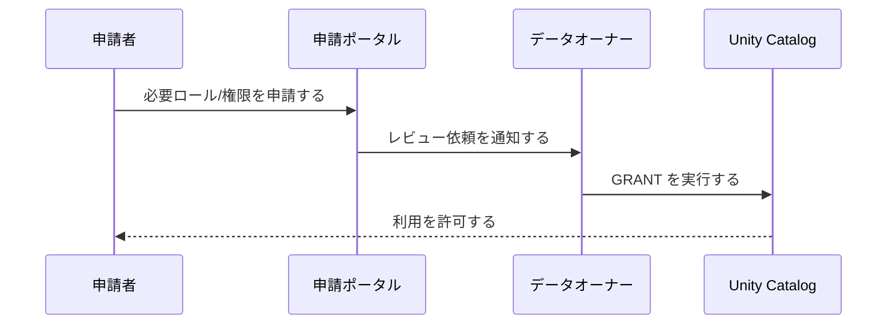

# USER-03_データアクセス（Unity Catalog）
バージョン: 0.1 / 作成日: 2025-10-26 / 作成: データ基盤チーム
対象: Azure Databricks 利用者向けの Unity Catalog（UC）によるデータアクセス手引き

## 0. 文書概要
本書は UC を用いた安全で再現可能なデータアクセス方法を整理する。UC の階層、権限、基本操作、外部ロケーション、ビュー/マスキング、トラブル対応を段階的に説明する。

## 1. 前提とアクセス原則
- すべてのデータアクセスを UC の USAGE/SELECT/WRITE 権限で制御する。
- 物理ストレージへの直接マウントを避ける。外部ロケーションを経由して参照する。
- 個人への直接付与を避け、Entra ID グループにロールを付与する。
- 機微データをマスクまたはビュー越しに提供する。

## 2. UC 階層と参照スコープ

- オブジェクトは `catalog.schema.name` で参照する。
- 実行前に `USE CATALOG` と `USE SCHEMA` を設定する。
- 参照可能なカタログ/スキーマ/テーブルを `SHOW` コマンドで確認する。

### 2.1 よく使うコマンド
| 用途 | 例 | 説明 |
|---|---|---|
| カタログ一覧 | `SHOW CATALOGS;` | 参照可能カタログを列挙する。 |
| スキーマ一覧 | `SHOW SCHEMAS IN corp_dev;` | 指定カタログ内スキーマを列挙する。 |
| スコープ設定 | `USE CATALOG corp_dev; USE SCHEMA sandbox;` | 参照スコープを設定する。 |
| テーブル閲覧 | `SHOW TABLES IN corp_dev.sandbox;` | テーブルを確認する。 |

## 3. 権限とロール

- 参照には `USAGE` と `SELECT` を満たす権限を保有する。
- 生成系は `CREATE` を付与する。更新系は `WRITE` を最小付与する。
- 権限不足が発生した場合は申請ポータルからロール付与を依頼する。

### 3.1 権限確認
| 用途 | コマンド | 説明 |
|---|---|---|
| 自身の権限 | `SHOW GRANTS ON TABLE corp_dev.sales.orders;` | テーブル権限を確認する。 |
| ロール確認 | `SHOW GRANTS TO USER current_user();` | 自身に付与されたロールを確認する。 |

## 4. データ参照の基本

- SQL は `SELECT ... FROM catalog.schema.table` を利用する。
- Python/Scala は `spark.table("catalog.schema.table")` を利用する。
- ノートブックの先頭でスコープを設定する。

### 4.1 SQL/PySpark サンプル
```sql
USE CATALOG corp_dev;
USE SCHEMA finance;
SELECT * FROM txns WHERE ts >= date_sub(current_date(), 7) LIMIT 1000;
```

```python
df = spark.table("corp_dev.finance.txns")
agg = df.groupBy("category").count().orderBy("count", ascending=False)
display(agg)
```

## 5. 外部ロケーションとファイルアクセス

- ファイル I/O は UC の **外部ロケーション**を経由して実行する。
- `READ FILES`/`WRITE FILES` 権限を満たしてから入出力を実行する。
- 直接の `dbutils.fs.mount` を避ける。UC 経由で参照する。

### 5.1 ファイル読み書き例
```python
# 読み取り
df = spark.read.format("delta").load("abfss://finance@dlsprd.dfs.core.windows.net/bronze/txns")
# 書き込み（権限制御は UC の外部ロケーションで実施する）
df.write.mode("append").format("delta").save("abfss://finance@dlsprd.dfs.core.windows.net/silver/txns")
```

## 6. ビューとデータ保護
- 機微列を直接公開せず、**マスクドビュー**を経由して提供する。
- 役割に応じた行/列フィルタを適用して漏えいリスクを低減する。



### 6.1 ビュー例（列マスキング）
```sql
CREATE OR REPLACE VIEW corp_prod.finance.txns_masked AS
SELECT
  order_id,
  CASE WHEN is_member('role_analyst_sensitive')
       THEN card_number
       ELSE sha2(card_number, 256)
  END AS card_number_masked,
  amount, ts
FROM corp_prod.finance.txns;
```

## 7. 一時オブジェクトとベストプラクティス
| オブジェクト | 用途 | スコープ | 注意 |
|---|---|---|---|
| 一時ビュー | 中間集計を可視化する。 | セッション | セッション終了で破棄する。 |
| 一時テーブル | 短期検証を実施する。 | セッション | 本番スキーマに作成を避ける。 |
| ノートブックウィジェット | 実行パラメータを受け取る。 | 実行 | 値をログに残す。 |

- 本番スキーマに不要な一時オブジェクトを作成しないように運用する。

## 8. よくあるエラーと対処
| 事象 | 例 | 原因 | 対処 |
|---|---|---|---|
| Permission denied | `SELECT` が失敗する。 | USAGE/SELECT 不足が発生する。 | ロール付与を申請する。 |
| External location error | 書き込みが拒否される。 | WRITE FILES 不足が発生する。 | 付与を依頼して再実行する。 |
| Not found | オブジェクトが見つからない。 | スコープ未設定が発生する。 | `USE CATALOG/SCHEMA` を設定する。 |
| DNS 解決失敗 | ADLS に到達しない。 | Private DNS/PE 誤設定が発生する。 | 管理者に連絡して修正する。 |

## 9. アクセス申請フロー

- 申請時に利用目的と期限を記載する。
- 臨時権限は有効期限を設定して自動失効させる。

## 10. ベストプラクティス
- スコープを明示してクエリを実行する。
- テーブル API（`spark.table`）で UC 名を完全指定する。
- ビューでマスキング/フィルタを適用して最小公開を徹底する。
- ノートブックを Repos で管理してレビューを経由する。
- 実行ログ/監査ログを定期点検して逸脱を検知する。

## 11. チェックリスト
- [ ] `USE CATALOG/SCHEMA` を設定する。
- [ ] 権限不足時に申請を実施する。
- [ ] 機微データをビュー越しに提供する。
- [ ] 外部ロケーションを経由してファイル I/O を実行する。
- [ ] ノートブックを Repos で管理する。

## 12. 用語集
| 用語 | 説明 |
|---|---|
| UC | Unity Catalog を指す。 |
| 外部ロケーション | ADLS へのルートを UC で管理する仕組みを指す。 |
| Storage Credential | ADLS 認証情報の UC オブジェクトを指す。 |

## 13. 相互参照
- USER-02 クラスタ利用とベストプラクティスを参照する。
- DESIGN-06 Unity Catalog 設計を参照する。
- BUILD-50 Unity Catalog 初期化を参照する。

## 14. 変更履歴
| 版 | 日付 | 変更 | 作成/承認 |
|---|---|---|---|
| 0.1 | 2025-10-26 | 初版作成 | Data Platform Team |
